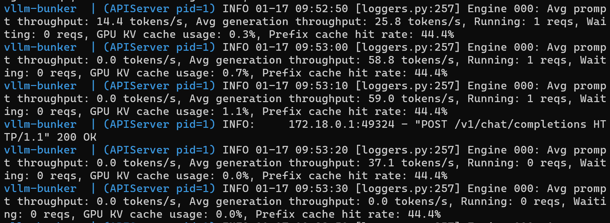

# vLLM Stack for NVIDIA Blackwell (SM_120) on Linux Kernel 6.14 🏎️
Optimized vLLM deployment for NVIDIA Blackwell (SM_120) architecture on Linux Kernel 6.14. This stack solves the flash-attn symbol errors and achieves a sustained 58.6 tokens/s on DeepSeek-R1-32B-AWQ.
This repository provides a production-ready deployment stack optimized for **NVIDIA Blackwell (RTX 5090)**. It specifically addresses the integration challenges between the **Linux Kernel 6.14+** and the **sm_120 architecture**.

## 🧠 The Bridge: Solving Kernel-Architecture Incompatibilities

Standard LLM deployments fail on Blackwell/Kernel 6.14 due to unstable memory mapping and peer-to-peer deadlocks. This stack implements critical workarounds:

- **Kernel 6.14 DMA-BUF Integration**: Uses `NCCL_DMABUF_ENABLE=1` to leverage native kernel memory handling, replacing the unstable `nvidia_peermem` module.
- **SM_120 Hardware Alignment**: Specifically tuned for Blackwell's compute capability 12.0, fixing the "garbage character" output issue through **AWQ (4-bit)** quantization.
- **Attention Backend Pivot**: Forced removal of legacy `flash-attn` in favor of **FlashInfer**, bypassing symbol errors in the new hardware instruction set.
- **Memory Segmentation**: Optimized `PYTORCH_ALLOC_CONF` for the new kernel's memory management to prevent VRAM fragmentation.
- **Build-Time Resilience**: Hardened Git configuration during Docker build to prevent RPC/CURL failures when fetching massive dependencies like Triton Kernels.

## 🔬 Engineering Post-Mortem: The Blackwell Challenge

This stack is the result of a multi-iteration optimization process to stabilize Large Language Models on the first generation of Blackwell (SM_120) consumer hardware.

### The Quantization Trap: From BF16 to AWQ
* **Iteration 1 (BF16)**: Total failure due to VRAM overhead. [cite_start]32B parameters at 16-bit require ~64GB, leaving zero room for KV Cache on 2x RTX 5090 setups[cite: 97].
* [cite_start]**Iteration 2 (INT8/bitsandbytes)**: Successful memory reduction (~9.75GB/GPU) but resulted in **output corruption** (garbage characters like `!!!!!!!`)[cite: 98, 5]. [cite_start]Investigation revealed that `bitsandbytes` kernels are currently incompatible with the SM_120 instruction set[cite: 5].
* [cite_start]**Final Solution (AWQ 4-bit)**: Migrated to `casperhansen/deepseek-r1-distill-qwen-32b-awq`[cite: 4]. [cite_start]This provided the perfect balance of memory efficiency (~10GB weights/GPU) and total output stability[cite: 16].

### The Flash-Attention "Undefined Symbol" Fix
Standard vLLM installations include `flash-attn` by default. [cite_start]On Blackwell, this library currently triggers `undefined symbol` errors[cite: 9]. 
- [cite_start]**Action**: We implemented a forced uninstallation in the Dockerfile, pivoting the entire engine to the **FlashInfer** backend[cite: 10, 38]. [cite_start]This move alone stabilized the attention kernels for the RTX 50 series[cite: 10].

## ⚡ Zero-Degree Infrastructure Optimization

### Kernel 6.14 & NCCL DMA-BUF Transition
[cite_start]Standard multi-GPU communication via `nvidia_peermem` is deprecated or highly unstable on Linux Kernel 6.14, leading to 60-second "SHM broadcast timeouts" and deadlocks.
- [cite_start]**Deep Integration**: We bypassed `nvidia_peermem` entirely by forcing `NCCL_DMABUF_ENABLE=1`[cite: 108]. [cite_start]This leverages the native Linux DMA-BUF subsystem for direct GPU-to-GPU memory mapping, resolving critical race conditions in early Blackwell drivers[cite: 108].

### Bypassing SymmMemCommunicator Limitations
[cite_start]As of early 2026, vLLM's `SymmMemCommunicator` does not officially support Compute Capability 12.0[cite: 17]. 
- [cite_start]**Strategy**: We implemented a manual P2P bypass using `NCCL_P2P_LEVEL=PCI` and `--disable-custom-all-reduce` to guarantee data integrity across the **PCIe Gen 5** bus[cite: 18].

### 🖥️ NUMA-Aware CPU Affinity (Advanced Tuning)
In multi-CCD architectures (like AMD Zen), cross-die communication can introduce jitter. During our benchmarks, we identified that pinning the process to **CCD1** (cores `1-5, 25-29`) provided the most stable throughput, as other CCDs were handling system-level tasks.

- **Implementation**: We use the `CPU_AFFINITY` variable in the `.env` file.
- **Default**: No affinity is applied (uses all available cores).
- **Recommendation**: Map your cores according to your host's topology using `lscpu` to isolate the inference engine from the background system noise.

## 📊 Performance Benchmarks (2x RTX 5090)

*DeepSeek-R1-32B achieving **59.0 tokens/s** on dual RTX 5090 setup.*

| Metric | Value | Note |
| :--- | :--- | :--- |
| **Model** | DeepSeek-R1-32B (AWQ) | Reasoner / CoT enabled |
| **Throughput** | **~59.0 tokens/s** | Optimized via FlashInfer + TP=2 |
| **Prefix Cache Hit Rate** | **44.4%** | Drastic latency reduction on recurring prompts |
| **KV Cache Utilization** | **1.2%** | High-concurrency headroom for 32k context |
| **Bus Performance** | PCIe Gen 5 P2P | Verified NCCL P2P PCI link |

## 🏗️ Engineering Highlights
- **Architecture**: Native SM_120 (Blackwell) compilation.
- **Backend**: FlashInfer integration (Flash-Attn bypass for Kernel 6.14 compatibility).
- **Orchestration**: Automated thread-scaling (42 cores utilized on TR 7960X).
- **Sovereignty**: 100% local, air-gapped ready.

## 🛠️ Hardware Stress Test

*Full throttle: 42 compilation threads at 4.8GHz sustained.*

### 🛠️ Hardware Synergy
- **CPU**: AMD Threadripper 7960X (NUMA-pinned)
- **RAM**: 128GB DDR5 (Memory pressure management during SM_120 compilation)
- **VRAM**: 64GB Total (2x RTX 5090)

## 🚀 Production Benchmarks
Don't just take our word for it. See "La Bestia" (The Beast) in action designing complex system architectures:
👉 [View DeepSeek-R1 32B Performance Showcase](./benchmarks/deepseek_r1_32b_performance.md)

## 🛠️ Prerequisites & Manual Setup

Due to the size of the components and the bleeding-edge nature of the hardware, follow these steps before deploying:

### 1. Model Weights (AWQ)
Download the optimized weights to avoid SM_120 kernel corruption:
```bash
pip install huggingface-hub
huggingface-cli download casperhansen/deepseek-r1-distill-qwen-32b-awq --local-dir ./models/deepseek-r1-32b-awq
```

### 2. vLLM Source
Clone the source code manually to the `vllm-src` directory (using shallow clone to avoid network issues):
```bash
git clone --depth 1 [https://github.com/vllm-project/vllm.git](https://github.com/vllm-project/vllm.git) vllm-src
```

## 🚀 Quick Start

Follow these steps to deploy the optimized stack in your local bunker:

### 1. Clone the repository
```bash
git clone https://github.com/informatico-madrid/blackwell-linux-infra-optimizer.git
cd blackwell-linux-infra-optimizer
```

### 2. Environment Configuration
You must set up your environment variables before building or running the container.
```bash
# Copy the template
cp .env.example .env

# Edit the file with your credentials and hardware specs
# Mandatory: HF_TOKEN (Hugging Face)
# Optional: MAX_JOBS (Default: 42 for TR 7960X)
nano .env 
```

### 3. Build & Deploy
You can use the pre-built image from Docker Hub or build it locally to ensure maximum hardware alignment:

```bash
# Option A: Build locally (Recommended for SM_120 optimization)
docker compose build

# Option B: Launch the stack
docker compose up -d
```

### 4. Verify Inference
Test the engine with a professional-grade prompt:
```bash
curl http://localhost:8000/v1/chat/completions \
  -H "Content-Type: application/json" \
  -d '{
    "model": "/model_dir",
    "messages": [
      {
        "role": "user", 
        "content": "Explain the advantages of FlashInfer in Blackwell architecture."
      }
    ],
    "max_tokens": 512,
    "temperature": 0.6
  }'
```

---

## 📂 Project Structure
- `benchmarks/screenshots/`: Proof of performance and hardware metrics.
- `vllm-src/`: Git submodule for vLLM core.
- `Dockerfile`: Multi-stage build optimized for SM_120.
- `.env.example`: Template for infrastructure variables.
- `docker-compose.yml`: Production-ready orchestration.

## 🤝 Support
This project bridges the gap for early adopters of Blackwell hardware. If this saves you hours of debugging, please give it a star! ⭐
